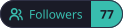
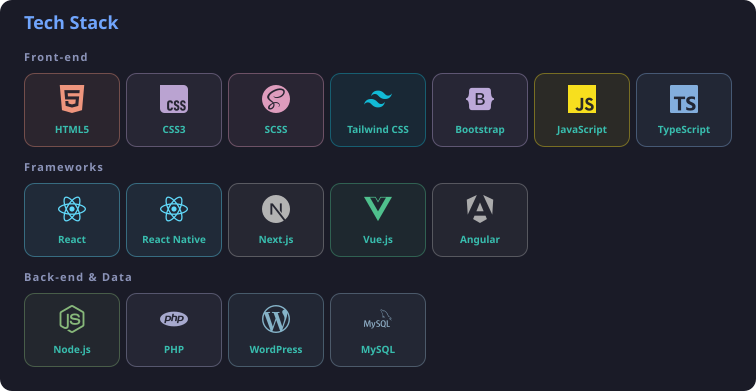
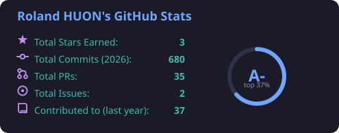
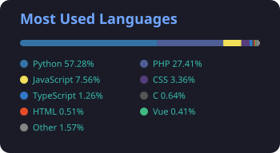
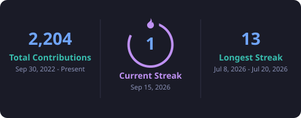
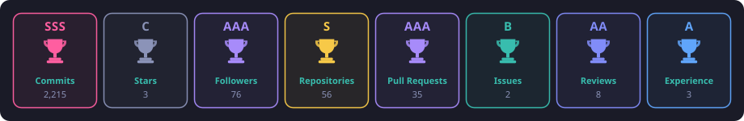

# **👋 Hello everyone !**

I am a **5th year student in web development** and I want to become a frontend / fullstack developer.
Follow me to discover my development and progress.

  
  
  

## 🧰 My stack

## 📊 GitHub stats

  
  

## 🏆 Trophies

---

Every image on this page is generated by my own code and refreshed automatically every 6 hours — no third-party service involved.
